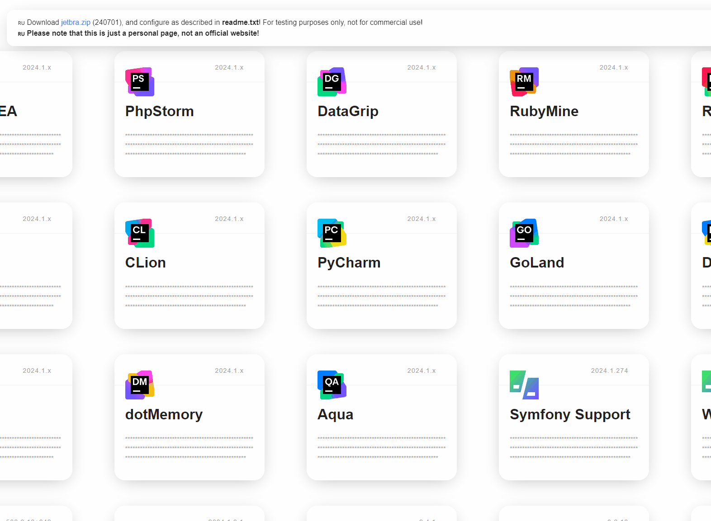
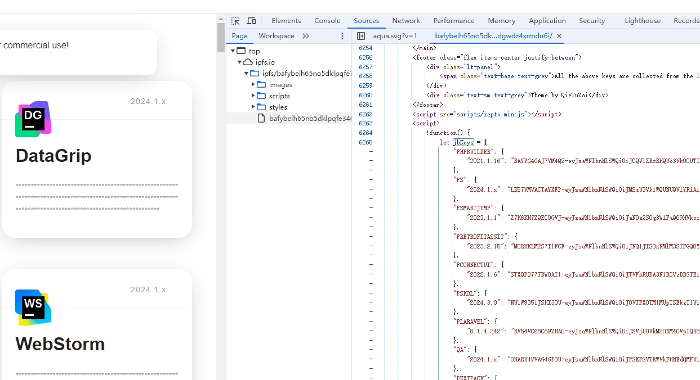

[English](README_EN.md)

# 3.jetbra.in

[3.jetbra.in](https://3.jetbra.in) 存档

## 使用方法

1. 初始化

    ```bash
    git clone https://github.com/jonssonyan/3.jetbra.in.git
    cd 3.jetbra.in
    pip install -r requirements.txt
    ```

2. 准备文件

    - 将网页另存为，复制 .html 文件，重命名为 [index.html](index.html)

      

    - 打开控制台的 Sources 选项，查看源文件，可以看到完整的 jbKeys 变量值，复制 jbKeys
      的值，存储在 [keys_origin.json](keys_origin.json)

      

3. 运行

    ```bash
    python main.py
    ```

4. 查看结果

   [key.json](keys.json)